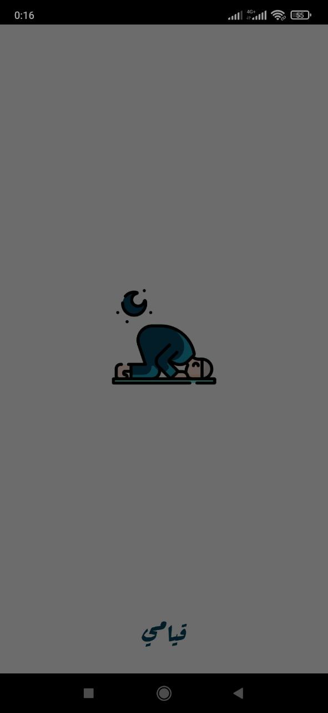
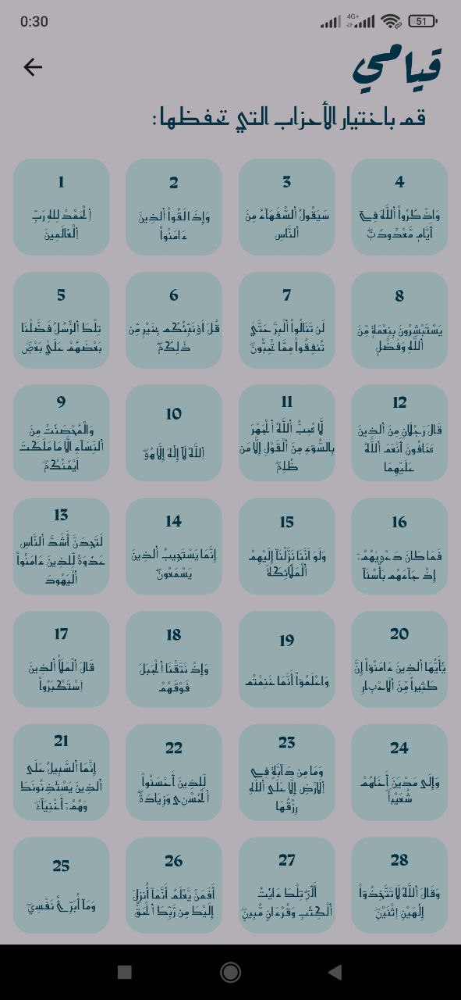
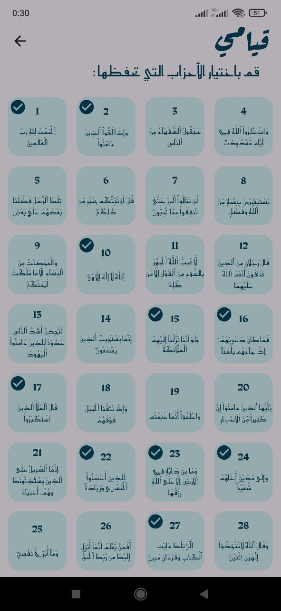

# qiyamy

Qiaymi is a side-project I have had the idea to work for a long time. Finally, I found enough time to start working on it (and hopefully finish it). I have decided to build it using Flutter to strengthen and deepen my knowledge about this framework.

The idea behind this project is simple: `Keep track of your journey with Holy Quran (القرآن الكريم)`. This includes: Memorization (المراجعة), Daily Wird (الورد اليومي) and Qiyam (القيام). Other use cases may be added later as needed.

## Mockups

The mockups of the app were created using [Figma](https://www.figma.com/) are as follows:

### Color palette: Summer Splash

<details>
<summary>Colors used in the app:</summary>

- Navy Blue `#05445e`
- Blue Grotto `#189ab4`
- Blue Green `#75e6da`
- Baby Blue `#d4f1f4`


From [Canva Color Palettes](https://www.canva.com/colors/color-palettes/summer-splash/) :blue_heart:

</details>

### Splash screen

Splash screen mockup:


### Home page

Home page mockup:


### Qiyam page

Qiyam page mockups:


### Wird page

Wird page mockup:


### More page

More page mockup:


## Results:

The app is currently under development, with several core features already implemented. Additional features are being added progressively, depending on the availability of my free time:

- [x] Display a list of Hizbs and Ajza'a (الأحزاب والأجزاء)
- [x] Choose randomly a Hizb for Qiyam (حزب القيام)
- [x] Store each randomly chosen Hizb.
- [x] Keep track of already chosen Hizbs and make sure they are not repeated
- [x] Keep track of daily Wird (الورد اليومي)
- [x] Add an option for the user to customize Qiyam Hizbs (what they memorize).
- [ ] Add an option for the user to choose the way the Hizb is choose: `Random` or `Sequential`
- [ ] Add Qiyam and Wird notifications and reminders
- [ ] Schedule the choice of Qiyam Hizb at a chosen time (at `12:00 AM` for example)
- [ ] Implement dark theme
- [ ] Add a share app possibility
- [ ] Add a rate us feature
- [ ] Optimize the app
- [ ] Deploy the app on Play Store
- [ ] Add an About section

## App Screenshots

Here are some screenshots of the app:

<div align="center" style="display: flex; flex-wrap: wrap; justify-content: center; gap: 20px;">

  <div style="flex: 1 1 200px; text-align: center;">
    
    <br>
    <strong>App icon</strong>
  </div>
  <div style="flex: 1 1 200px; text-align: center;">
    
    <br>
    <strong>Splash screen</strong>
  </div>

  <div style="flex: 1 1 200px; text-align: center;">
    
    <br>
    <strong>Main page: Ahzab tab</strong>
  </div>
  <div style="flex: 1 1 200px; text-align: center;">
    
    <br>
    <strong>Main page: Ajza'a tab</strong>
  </div>
  <div style="flex: 1 1 200px; text-align: center;">
    
    <br>
    <strong>Qiyam page</strong>
  </div>

  <div style="flex: 1 1 200px; text-align: center;">
    
    <br>
    <strong>Qiyam page: choosing a hizb</strong>
  </div>
  <div style="flex: 1 1 200px; text-align: center;">
    
    <br>
    <strong>Qiyam page: After choosing a hizb</strong>
  </div>
  <div style="flex: 1 1 200px; text-align: center;">
    
    <br>
    <strong>Qiyam page: Already chosen hizbs</strong>
  </div>

  <div style="flex: 1 1 200px; text-align: center;">
    
    <br>
    <strong>Wird page: daily Wird</strong>
  </div>
  <div style="flex: 1 1 200px; text-align: center;">
    
    <br>
    <strong>Wird page: if finish Wird</strong>
  </div>
  <div style="flex: 1 1 200px; text-align: center;">
    
    <br>
    <strong>More page</strong>
  </div>

  <div style="flex: 1 1 200px; text-align: center;">
    
    <br>
    <strong>Choosing memorized hizbs</strong>
  </div>
  <div style="flex: 1 1 200px; text-align: center;">
    
    <br>
    <strong>Choosing memorized hizbs</strong>
  </div>
  <div style="flex: 1 1 200px; text-align: center;">
    
    <br>
    <strong>Save chosen memorized hizbs</strong>
  </div>
</div>

## 🚀 How to Run Qiymay

For now, Qiyamy app is not yet deployed. Therefore, to run it locally follow the steps below :

### Prerequisites

Before you begin, ensure you have the following installed:

1. **Flutter SDK**: [Install Flutter](https://flutter.dev/docs/get-started/install)
2. **Android Studio**: [Install Android Studio](https://developer.android.com/studio)
3. **Emulator or Physical Device**: Set up an Android emulator or connect a physical device.
4. **Git**: [Install Git](https://git-scm.com/downloads)

### Clone the Repository

1. Open your terminal or command prompt.
2. Navigate to the directory where you want to clone the project.
3. Run the following command to clone the repository and navigate into it:
   ```bash
   git clone https://github.com/izblackcat/qiyami.git
   cd qiyamy
   ```

### Install dependencies

4. Install the project dependencies by rnning:
   ```bash
   flutter pub get
   ```

### Set Up the Emulator or Physical Device

#### For Android Emulator:

1. Open Android Studio.
2. Go to **Tools > Device Manager**.
3. Create or select an existing Android Virtual Device (AVD).
4. Start the emulator.

#### For Physical Device:

1. Connect your Android/iOS device to your computer via USB.
2. Enable **USB Debugging** on your device (for Android, go to **Settings > Developer options**).
3. Verify the connection by running:
   ```bash
   flutter devices
   ```
   You can refer to the [Docs](https://docs.flutter.dev/platform-integration/android/install-android/install-android-from-windows) if needed.

### Run the project

5. Ensure that your emulator is launched and run the following command:
   `bash
flutter run
`
   The app should now build and run on your emulator or physical device. :blush:
